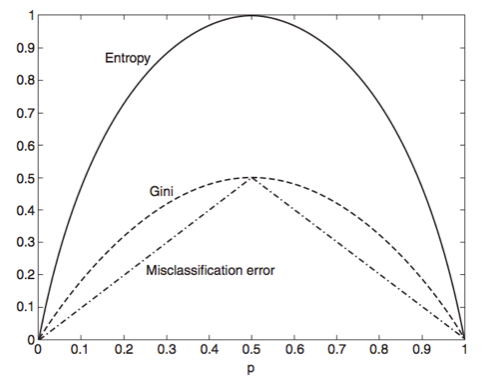

slidenumbers: true
footer:  J. Pounders, DSI-EAST-1

#   Introduction to CARTs
#### Author: Justin Pounders, DSI-ATL-3

---

# Objectives

- Describe how decision tree models work
- Define the concept of purity and information gain
- Describe how model ensembles lead to better performance
- Define boosting and model aggregation (aka bagging)
- Build decision tree and random forest models in `sklearn`
- Add ensemble bagging to any classification model in `sklearn`

---

# Guess what animal I am thinking of.

---

# Intro to CARTs

### CART = Classification and Regression Tree

### CART = Decision Tree

---

---

---

---

---

---

---

---

---

---

---

---

---

# Building Decision Trees

- You've seen that decision trees *split* the data at each node
- For each split we can calculate *purity*

---

# Building Decision Trees 

$$
\begin{align}
\text{purity of class i} &= p(\text{class i}|\text{data at node}) \\ &= p(i\;|\;D)
\end{align}
$$

- For binary classification:
  - Worst case, purity = 0.5
  - Best case, purity = 1.0

---

# Generalizing Purity

*Im*purity measures for a node with data $$D$$

$$ \text{Entropy} = - \sum_{i=1}^{classes} p(i\;|\;D) \;log_2 \; p(i\;|\;D) $$

$$ \text{Gini} = \sum_{i=1}^{classes} p(i\;|\;D)(1 -p(i\;|\;D)) = 1 - \sum_{i=1}^{classes} p(i\;|\;D)^2 $$

---

---

# Information Gain

**Goal**: determine how good a split is

**Solution**: gain

$$ \text{gain} = I(\text{parent}) - \sum_{\text{children}}\frac{N_j}{N}I(\text{child}_j) $$

where $$I$$ is the impurity measure, $$N_j$$ is the number of observations at child node $$j$$, and $$N$$ is the number of observations at the parent node.

---
[.build-lists: true]

# Full CARTs

- So far we've seen trees for *classification*
- Decision trees can be used for *regression* too

---
[.build-lists: true]

# Decision Trees
## Notes and Observations

- Decision trees are *hierachical*
  - Sequence of "if-this-than-that" conditions
- Decision trees are *non-parametric*
  - No $$\beta$$ coefficients!
  - No assumption on distributions

---

# Decision Trees
## Notes and Observations

**CART advantages**

- Simple to understand and interpret.
- Requires little data preparation. 
- Able to handle both numerical and categorical data. 
- Possible to validate a model using statistical tests.
- Once trained can be implemented on hardware and has extremely fast (real-time) execution.

---

# Decision Trees
## Notes and Observations

**CART disadvantages**

- Locally-optimal.
- Overfitting.
- There are concepts that are hard to learn  (XOR, parity or multiplexer problems)
- Decision trees  can be  biased if some classes dominate.

